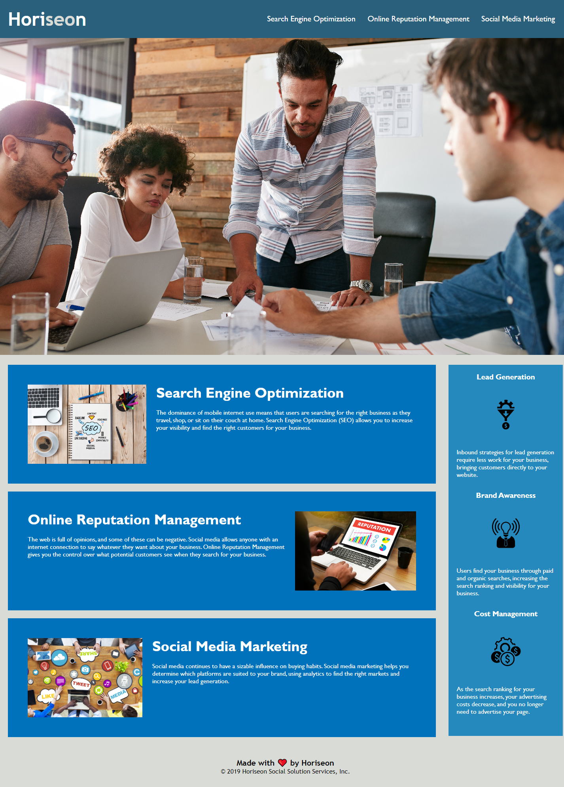

# <Horiseon>

## Description

Provide a short description explaining the what, why, and how of your project. Use the following questions as a guide:

- What was your motivation?
- Why did you build this project? (Note: the answer is not "Because it was a homework assignment.")
- What problem does it solve?
- What did you learn?

This project is designed to emulate a main web page for a company. To help the company comply with accessibility standards, I edited the HTML and CSS files associated with the website to help consolidate redundant CSS selectors, replace non-descript div elements with appropriate, semantic HTML elements, and added comments to provide clarification on what I changed, as well as highlight the associated HTML elements for the various CSS classes/selectors. 


## Usage

Provide instructions and examples for use. Include screenshots as needed.

To add a screenshot, create an `assets/images` folder in your repository and upload your screenshot to it. Then, using the relative filepath, add it to your README using the following syntax:

    ```md
    
    ```
Access the website at the provided URL: 

The website should resemble the atatched screenshot:

md
    

## Credits

N/A

## License

N/A
